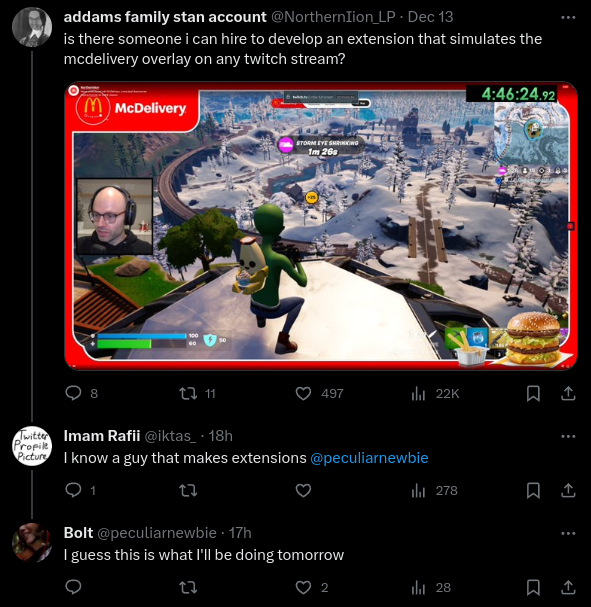

## How to Install

I wanna add the ability to use whatever image before submiting to the extension stores.

For now you can:

1. Download this [zip](https://github.com/peculiarnewbie/twitch-delivery-overlay/releases/download/v0.1/twitch-overlay.zip) or from releases and unzip it
2. Follow this guide to install https://developer.chrome.com/docs/extensions/get-started/tutorial/hello-world#load-unpacked

## Why?

literally just this

---

Built with [plasmo](https://www.plasmo.com/)
